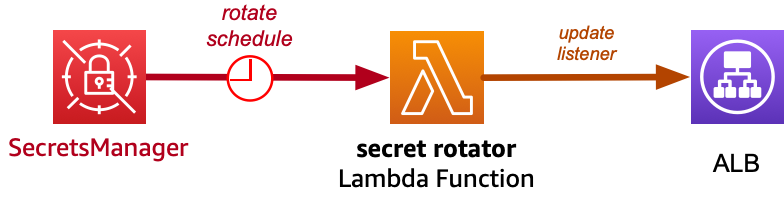
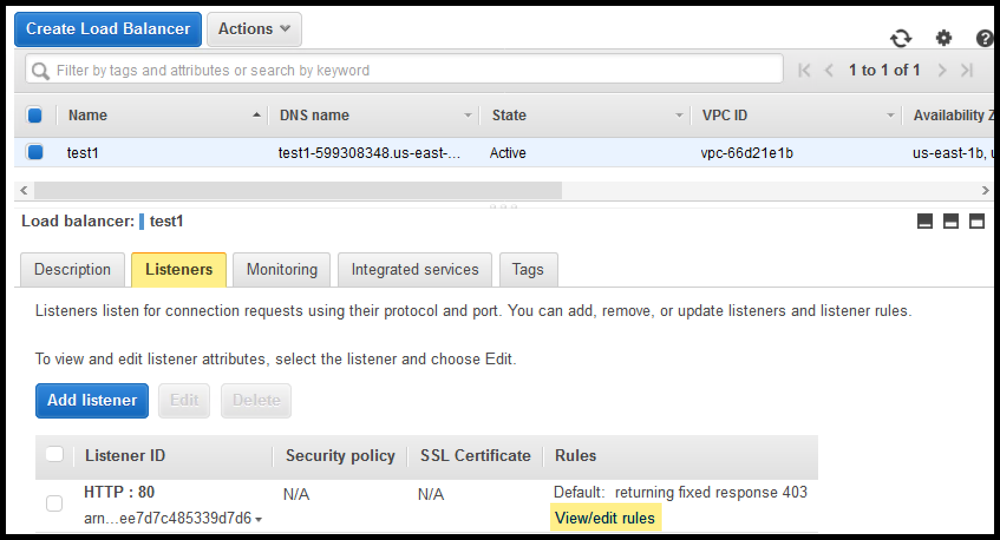
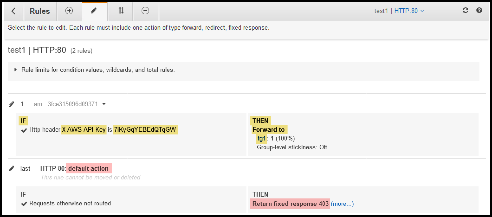

Secrets Rotator with ALB support
================================

* This example contains a **Lambda Function** that will rotate a secret and update a **Lambda Function**.



* The **Secret** contains a json map with 3 keys and associated randomly generated strings.

  ```json
  {
    "key1": "<required:string>",
    "key2": "<required:string>",
    "key3": "<required:string>",
  }
  ```

* The Lambda function will read the existing map of keys, **pop** the old key1, then **push** a newly generated key.


* The Lambda function will update a **Application Load Balancer Listener** _(ALB)_ used by the secret.
* The ALB Listener will inspect a **custom header**, `X-AWS-API-Key`. If the static API Key matches, then the traffic is forwarded.








## CloudFormation

* This sample code includes **CloudFormation** which will deploy the **Secret** and the **Lambda Function** that is used to rotate the **Secret**.
* The **CloudFormation** was generated from the included **CDK** code.
* The **CloudFormation** is `alb_secrets_stack.yaml`.
* The CloudFormation requires that a zip file containing the Lambda function be already uploaded to an S3 bucket. The stack will take in two parameters specifying the bucket name and zip file name to be used in the creation of the Lambda function.


## CDK

* This sample code includes **CDK** code which will deploy the **Secret** and the **Lambda Function** that is used to rotate the **Secret**.
* Below are instructions for using CDK.

### Install CDK

* **cdk** is a **NodeJS** app.
* Install NodeJS.
* Use `npm` to install `cdk`

```bash
sudo npm install -g --force cdk
```

### Create Python Virtual Environment

```bash
python3 -m venv .venv
source .venv/bin/activate
```


### Install Python-specific CDK modules

* Each service such as **Elastic Load Balacning** _(`aws_cdk.aws_elasticloadbalancingv2`)_ or **lambda** _(`aws_cdk.aws_lambda`)_, has its own module which must be defined in `requirements.txt`.

```bash
pip3 install -r requirements.txt
```


### Build the Cloudformation from CDK

To build this example, you need to be in this example's root directory. Then run the following:

```bash
cdk synth
```

* This will build the CloudFormation template. The resulting CloudFormation template will be in the `cdk.out` directory.
* If you want to see the `yaml` formatted CDK for a Stack, pass it as a name to the `cdk synth` command:

```bash
cdk synth AlbSecretsStack
```

### Deploy using CDK

Run `cdk deploy`. This will deploy / redeploy your Stack to your AWS Account.


