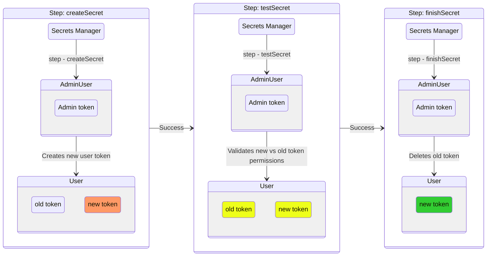

# Amazon InfluxDB Multi User Rotator

## Getting Started
The InfluxDB Multi-User Rotator is used to rotate a user's authorization token or credentials with the use of the AWS Secrets Manager. The Multi-user rotator operates by using an operator authenticated session to rotate a user's token or credentials with a new permission identical token or credential. The rotating token or credentials can have any permissions, and the Secrets Manager token must be an operator token. See [InfluxDB Documentation](https://docs.influxdata.com/influxdb/v2/admin/tokens) for how to create and manage tokens. The benefit of using an operator token to rotate a user's token is that the rotating user does not require the associated read and write permissions to complete the token rotation.

### InfluxDB Multi-user Token Rotation State Diagram

The InfluxDB Multi-user Token Rotation State Diagram illustrates how an admin user's token authenticates the rotation of another user's token with each successful step provided by the `Secrets Manager`.



## Permissions
The `InfluxDB Multi-user Rotation Lambda` rotates existing tokens with the same permissions that are defined for the token in the DB instance. This is to avoid any scenarios where a tokens permissions can escalate during the rotation. Changing the type of the authentication token will not change the permissions for that token. If you wish to alter the permissions of a token with this lambda function, a new non-operator token must be created and can only be created when the environment variable `AUTHENTICATION_CREATION_ENABLED` is set to `true` in the lambda function. The token type and permission values defined in a secret, are only applied to a token when a new secret is defined without a token value.

## Create Secret
1. Open the AWS console
- Navigate to `Secrets Manager`
- Click `Store a new secret`
- Select `Other type of secret`
- Click on `Plaintext` under `Key/value pairs`
- Fill in one of the following options in the text box:

Token Credentials (for token rotation)
```
{
    "engine": "timestream-influxdb",            // mandatory engine name
    "org": "string",                            // mandatory organization to associate token with
    "operatorTokenArn": "string",               // mandatory arn for operator token
    "type": "string",                           // "allAccess" or "operator" or "custom"
    "dbIdentifier": "string",                   // mandatory DB instance identifier
    "token": "string",                          // optional, actual secret string. If added the lambda will delete this value and rotate to new value. If token type is operator the field is mandatory. If ommitted a new token will be created when authentication creation is enabled.
    "writeBucket": ["string", "string", ...],   // optional list of bucketIDs, must be input with the plaintext panel of the secrets manager.
    "readBucket": ["string", "string", ...],    // optional list of bucketIDs, must be input with the plaintext panel of the secrets manager.
    "permissions": ["string", "string", ...]    // optional list, i.e. ["write-tasks", "read-tasks"], must be input with the plaintext panel of the secrets manager.
}
```

Username and Password Credentials (for rotating user password)
```
{
    "engine": "timestream-influxdb",            // mandatory engine name
    "username": "string",                       // mandatory username for rotating user
    "dbIdentifier": "string",                   // mandatory DB instance identifier
    "operatorTokenArn": "string",               // mandatory arn for operator token
    "org":  "string",                           // optional, scope for user
    "password": "string"                        // optional, user will be created if empty and authentication creation is enabled
}
```
- Click `Next`
- Enter a name for the secret of your choosing
- Click `Next`
- Click `Next` again as we will configure the rotation after we deploy the lambda
- Click `Store`

> **NOTE**: If the token type is of type `custom`, you must enter and make any edits to the secret value in the `plaintext` panel of the `Secret Manager` console. See the following example of a token secret of type `custom`:
```
{
    "engine": "timestream-influxdb",
    "type": "custom",
    "operatorTokenArn": "arn:aws:secretsmanager:<region>:<account_id>:secret>:...",
    "dbIdentifier": "abcdefg",
    "token": "1234567890abcdefghijklmnop==",
    "org": "org",
    "writeBucket": ["bucket1","bucket2"],
    "readBuckets": ["bucket1","bucket2"],
    "permissions": ["write-buckets","read-buckets"]
}
```


## Deploy Lambda
1. Execute script with the following command (Requires pip3 installed)
- If you are using macOS or Linux, execute the following commands
  - `./build_deployment.sh`_(to build deployable lambda function package from the source code)_
  - Execute the following command to add execution permissions to your deployment package
  - `sudo chmod +x influxdb-token-rotation-lambda.zip`
- If you are using Windows, execute the following command
  - `./build_deployment.ps1`_(to build deployable lambda function package from the source code)_

2. Open the AWS console
- Navigate to `Lambda`
- Click `Create function`
- Enter a function name of your choosing
- Select `Python 3.12` for the Runtime
- Click `Create function`

3. Upload the deployment package
- Click on `Upload from` and select `.zip` file
- Click `Upload` and select the `influxdb-token-rotation-lambda.zip` deployment package
- Click `Save`

4. Configure environment variables for the lambda function
- Click on `Configuration`
- Click on `Environment Variables` and click on `Edit`
- Click on `Add environment variable`
- Enter `SECRETS_MANAGER_ENDPOINT` for the key value
- Enter `https://secretsmanager.<region>.amazonaws.com` and replace `<region>` appropriately (Must be same as `Secrets Manager`)
- Click `Save`

5. If you wish to enable authentication creation with secrets, add the following environment variable
- Click on `Add environment variable`
- Enter `AUTHENTICATION_CREATION_ENABLED` for the key and `true` for the value
- Click `Save`

6. Configure lambda role
- Click on `Permissions`
- Under `Execution role` click on the link to the lambda role
- Under `Permissions policies` click `Add permissions` and `Create inline policy`
- Click on `JSON` and replace the json in the text editor with the following:

```
{
    "Version": "2012-10-17",
    "Statement": [
        {
            "Effect": "Allow",
            "Action": [
                "secretsmanager:DescribeSecret",
                "secretsmanager:GetSecretValue",
                "secretsmanager:PutSecretValue",
                "secretsmanager:UpdateSecretVersionStage"
            ],
            "Resource": "<user_secret_arn>"
        },
        {
            "Effect": "Allow",
            "Action": [
                "secretsmanager:GetSecretValue"
            ],
            "Resource": "<operator_secret_arn>"
        },
        {
            "Effect": "Allow",
            "Action": [
                "secretsmanager:GetRandomPassword"
            ],
            "Resource": "*"
        },
        {
            "Action": [
                "timestream-influxdb:GetDbInstance"
            ],
            "Resource": "arn:aws:timestream-influxdb:<region>:<account_id>:db-instance/<db_instance_id>",
            "Effect": "Allow"
        }
    ]
}
```
- Replace `<region>`, `<account_id>`, `<db_instance_id>`, `<user_secret_arn>`, and `<operator_secret_arn>` appropriately
- Click `Next`
- Enter a `Policy name` of your choosing and click `Create policy`

7. Configure invoke lambda permissions for the lambda function
- Navigate back to the lambda function `Permissions` section
- Under `Resource-based policy statements` click `Add permissions`
- Click on `AWS service`
- Select `Secrets Manager` under `Service`
- Enter a `Statement ID` of your choosing
- Select `Lambda:InvokeFunction` under `Action`
- Click `Save`

8. Configure lambda function timeout
- Navigate to the lambda function `General configuration` section
- Under `General configuration` click `Edit`
- Set the `Timeout` value to 1 minute
- Click `Save`

## Configure Token Rotation
1. Open the AWS console
- Navigate to `Secrets Manager`
- Select the secret that was previously created
- Click `Rotation` and then `Edit rotation`
- Click on `Automatic rotation`
- Fill in the rotation schedule of your choosing
- Under `Rotation function` select the lambda function we previously deployed
- Ensure the checkbox to rotate immediately when stored is selected
- Click `Save`

## Verify
1. In the secret that we created navigate to the `Overview` section
- Click `Retrieve secret value`
- If everything went correctly you should see a new token value under `influxdb-user-token`
- If the value for `influxdb-user-token` has not changed, see section [Viewing CloudWatch Logs](#viewing-cloudwatch-logs) for troubleshooting

## Viewing CloudWatch Logs
1. Navigate to `Lambda`
- Click on the function created for rotating your `InfluxDB` token
- Click on `Monitor`
- Click on `View CloudWatch logs`
- Click on the latest log stream under `Log streams`
- Look for any `Error` or `Info` logs that can help determine the reason for failure to rotate the token

## Adding Rotation Lambda to same VPC as Timestream for InfluxDB
**Note** - This is not required, but is a configuration option for users requiring the `InfluxDB Rotation Lambda` to run on the same `VPC` as their `Timestream for InfluxDB` Instance.

1. Adding the `InfuxDB Rotation Lambda` to a `VPC` will require the addition of a `NAT Gateway`
- We will create three `Subnets`(One for each `availability zone`) pointing to one `Route table` that routes to the `NAT Gateway`
- Your `Timestream for InfluxDB` instance should already have a `VPC` with a `Subnet` and `Route Table` to an `Internet Gateway`
- If your `VPC` already has a `NAT Gateway` with appropriate `Subnet` and `Route Tables`, you can skip to step `#5`

<br>

2. Create a `NAT Gateway`
- If you already have a `NAT Gateway`, skip to step `#3`
- Click on `NAT Gateway` in the left side bar
- Click on `Create NAT Gateway`
- Fill in the `Name` of your choosing, and select the `Subnet` to be `lambda-subnet-point-to-ig` that you created earlier
- Select `Public` for `Connectivity type` and click `Allocate elastic IP`
- Click `Create NAT Gateway`

<br>

3. Create a `Route Table` for the `NAT Gateway`
- If you already have a route to a `NAT Gateway`, skip to step `#4`
- Click on `Route tables` in the left side bar
- Click `Create route table`
- Fill in the `Name` portion and select the `VPC`
- Click `Create route`
- Click on `Edit routes` and `Add route`
- Select `0.0.0.0/0` for the `Destination`
- Select `NAT Gateway` for `Target` and fill in the `NAT Gateway` we created earlier
- Click `Save Changes`

<br>

4. Adding `Subnets` for the `Nat Gateway`
- If you already have three `Subnets` for the `NAT Gateway`, skip to step `#5`
- Navigate to `VPC` and select `Subnets` in the left side bar
- Click `Create subnet` and select the `VPC ID` of your `VPC`
- We will create three subnets pointing to the `NAT Gateway`, each incrementing the second to last byte of the `IPv4 subnet CIDR block` address by 16, ensure these addresses don't overlap with already existing `Subnets`
- Each `Subnet` will be in their own `availability zone`
- See the following table for reference, and set the IP's dependent on your `VPC IPv4 CIDR`

<br>

| VPC | CIDR | Name |
| --- | ---- | --- |
| vpc-123abc123abc (ip.of.your.vpc/16) | 123.123.0.0/20  | lambda-subnet-point-to-nat-1 |
| vpc-123abc123abc (ip.of.your.vpc/16) | 123.123.16.0/20 | lambda-subnet-point-to-nat-2 |
| vpc-123abc123abc (ip.of.your.vpc/16) | 123.123.32.0/20 | lambda-subnet-point-to-nat-3 |

- Click on the `Create Subnet` for each `Subnet` in the table

<br>

5. Setup `InfluxDB Rotation Lambda`
- Navigate to `Lambda` and select the `InfluxDB Rotation Lambda`
- Click on `Configuration` and select `VPC` in the left side bar
- Click on `Edit` under `VPC`
- Select the `VPC` of the `Timestream for InfluxDB` instance
- Select the three subnets pointing to the `NAT Gateway`
- Select the default security group
- Click `Save`

<br>

6. Your `InfluxDB Rotation Lambda` should now have internet access
- Below I have listed all required components to the VPC for reference
- Your configuration may look different, but if you have a `Route` from your private `Subnets` to a `NAT Gateway` linking through to the `Internet Gateway`, the lambda function should have internet access

<br>

| VPC | CIDR | Name | Route Table | Network Connection |
| --- | ---- | --- | --- | --- |
| vpc-123abc123abc (ip.of.your.vpc/16) | 123.123.0.0/20  | lambda-subnet-point-to-nat-1 | route-to-nat-gw | NAT Gateway |
| vpc-123abc123abc (ip.of.your.vpc/16) | 123.123.16.0/20 | lambda-subnet-point-to-nat-2 | route-to-nat-gw | NAT Gateway |
| vpc-123abc123abc (ip.of.your.vpc/16) | 123.123.32.0/20 | lambda-subnet-point-to-nat-3 | route-to-nat-gw | NAT Gateway |
| vpc-123abc123abc (ip.of.your.vpc/16) | 123.123.48.0/20 | lambda-subnet-point-to-ig    | route-to-ig     | Internet Gateway |

## VPC Network Configuration Diagram


## Testing

### Integration Tests

To run the integration tests using the default region defined in the `AWS_DEFAULT_REGION` environment variable, execute the following while your shell is in the `integration` directory:

```shell
python3 integration_test.py
```

If the `AWS_DEFAULT_REGION` environment variable is not set or you wish to use a different region, the `--region <region name>` argument will let you set the region to use.

The integration tests will use `boto3` to create a new Timestream for InfluxDB instance (size medium with 20GB of of storage), a VPC required for the Timestream for InfluxDB instance, a lambda function containing `lambda_function.py` and dependencies, an admin secret, and a user secret, which will be rotated. The integration tests tags these resources; if resources with these tags already exist, then these existing resources will be used.

In addition to the above-mentioned `--region` argument, the integration tests support inividual test arguments, such as running an individual test with `python3 integration_test.py SecretsTestCase.test_operator_token_rotation`, and the option to delete all tagged integration test resources after testing by using `--cleanup`.

> **NOTE**: The secrets created by the IT test should not be deleted via the AWS console, as deletion via the AWS console puts secrets into a pending deletion stage where secrets will still be identified by the integration tests. If you wish to delete the integration test secrets manually, without using `--cleanup`, delete them using the AWS CLI with `aws secretsmanager delete-secret --secret-id <secret ID> --force-delete-without-recovery`.
